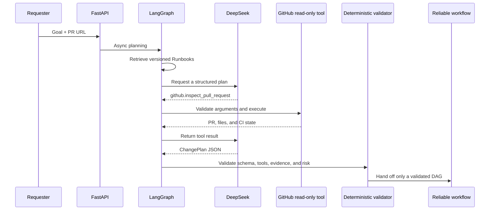

# Async Tool Calling and GitHub Context

## Goal

The first V2 increment extends ChangePilot from planning only over forms and
Runbooks to a Release Agent that can actively inspect real engineering
context. A requester may attach a GitHub pull request URL. In online DeepSeek
mode, native Function Calling reads PR metadata, changed files, and CI checks
before the model returns a structured change plan.

## Native Tool Calling

Names such as `schema.migrate` in the execution plan are future actions.
Function Calling is an immediate observation requested by the model while it
plans. ChangePilot keeps them in separate registries:

- discovery tools are async, read-only, and bounded by a call-round limit;
- execution tools are versioned and carry risk and idempotency contracts, and
  the reliable runtime may call them only after required approval.

The model cannot deploy, execute SQL, or run shell commands through Function
Calling.

## Async Boundary

The FastAPI submission endpoint is async and moves the remaining synchronous
sandbox work to a worker thread. LangGraph uses `ainvoke`, DeepSeek uses
`AsyncOpenAI`, and GitHub uses `httpx.AsyncClient`. Model and external API waits
therefore do not block the API event loop, while existing synchronous service
interfaces remain available to CLI and offline tests.

## GitHub Safety Boundary

`github.inspect_pull_request` accepts only
`https://github.com/{owner}/{repository}/pull/{number}`. It fixes the host and
scheme, binds the tool to the PR submitted by the requester, does not follow
redirects, calls read endpoints only, reads credentials
from the environment, validates every argument with Pydantic, rejects unknown
tools, and limits tool-call rounds.

Tool output remains untrusted context. The resulting plan still passes the
existing schema, allowlist, evidence, risk, approval, and compensation
validators.

## Observability and Boundary

The planning trace records tool name, round, status, latency, arguments, and a
bounded output summary. The console displays Function Calling separately from
RAG evidence.

`deterministic_mock` remains the default offline mode. Set
`CHANGEPILOT_PLANNER_MODE=deepseek` to enable the real async model and native
Function Calling. GitHub is read-only in this increment, and execution still
targets the local order-service sandbox.
