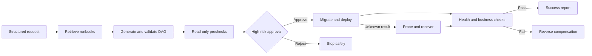

# ChangePilot User Guide

On the first visit, the console opens a short in-product guide automatically.
Use **Guide** in the top bar to reopen it, or choose **Start guided demo** to
move directly into scenario creation.

## In One Sentence

ChangePilot is a **bounded Agent prototype for high-risk engineering
changes**. It turns a service-and-database upgrade goal into an evidence-cited
plan, waits for human approval before dangerous effects, and then executes,
verifies, compensates, or recovers through a reliable workflow runtime.

The current release deliberately bounds the Agent to one service and two
change intents:

> Upgrade `order-service` and its database schema from V1 to V2.
>
> Assess the current V1 service and database readiness without changing them.

This bounded domain makes planning differences, tool calls, approval,
idempotency, compensation, and recovery testable. V1 does not hide its safety
boundary behind arbitrary shell or SQL execution.

## The Problem

A real engineering change is more than a command. Someone must understand the
goal, retrieve runbooks, analyze dependencies, identify risk, request approval,
execute effects, validate the result, handle failure, and preserve evidence.

ChangePilot organizes those decisions into a bounded Agent control plane. A
model may propose the plan; deterministic code owns authorization, state
transitions, side effects, recovery, compensation, and audit.

## What It Is Not

- It is not a general chatbot.
- It is not a replacement for coding Agents such as Claude Code or Codex.
- It is not yet a production deployment platform.
- It is not an arbitrary command executor.
- It does not let the model authorize its own dangerous actions.

## Users

| Role | Responsibility |
| --- | --- |
| Requester | Provide the goal, success conditions, and constraints |
| Operator | Review evidence, risk, and compensation; approve or reject |
| Platform engineer | Define tools, policies, runbooks, adapters, and safety boundaries |
| Auditor/on-call engineer | Inspect terminal reports, failures, compensation, and events |

## Closed Loop



The Agent observes requests, evidence, and system state; reasons over a
goal-directed plan; acts through versioned tools; and uses results to continue,
compensate, recover, or stop.

## Using GitHub PR Context

The change form accepts an optional GitHub pull request URL. Offline mode keeps
the context without accessing the network. In online DeepSeek mode, the model
may call `github.inspect_pull_request` to read the PR title, branches, changed
files, and CI checks.

The console displays actual calls under **External tool calls** and Runbook
citations under **RAG evidence**. Both inform planning, but neither can bypass
the final tool allowlist, risk policy, or approval validation.

The GitHub integration is read-only and accepts only canonical
`https://github.com/.../pull/...` URLs. It cannot merge a PR, change code,
trigger workflows, or execute a release.

## Reading the Console

Start with the run orientation at the top of the center workspace:

1. **Journey** shows Request, Plan review, Precheck, Approval, Execution,
   Verification, and Outcome.
2. **Current decision** explains why the run paused or how it ended.
3. **Next action** identifies the operator's single primary action.
4. **Change context** shows the target, versions, success condition, and
   constraints.
5. **Active safeguards** lists the controls actually enabled for the run.
6. **Agent planning trace** shows each planning stage, exact RAG evidence,
   validation status, knowledge snapshot, and model budget usage.

The remaining workspace is organized by responsibility:

- left: run selection and state filtering;
- center: DAG dependencies, risk, evidence, validation, and compensation;
- right: approval, recovery, ordered audit events, and terminal reports.

Technical step IDs, tool names, and event types remain untranslated so they
match the API, source, and audit records exactly. Interface copy can switch
between English and Chinese.

## Five-Minute Success Demo

Install Python and console dependencies, then run:

```powershell
.\scripts\start-operations-demo.ps1
```

Open `http://127.0.0.1:5173`, create a **Successful upgrade**, and inspect the
run. Read-only checks finish before `migrate-schema`, where the workflow pauses.
Review the migration evidence and `schema.rollback` compensation tool, then
approve. The workflow migrates, deploys, checks health, and runs an order smoke
test. The outcome becomes `succeeded`, and a terminal report becomes available.

## Reliability Demos

**Health failure** injects a permanent V2 health-check failure. The workflow
compensates completed reversible effects in reverse order:

```text
service.restore -> schema.rollback
```

The terminal state is `compensated`.

**Restart recovery** interrupts after the schema migration committed but before
the workflow acknowledged its result. Recovery probes the migration ledger,
confirms the existing effect, and continues without applying the migration
twice.

**Readiness assessment** demonstrates that the plan is not a fixed V1-to-V2
template. The same planning pipeline interprets a read-only goal and produces
only service inspection, database inspection, and compatibility precheck
steps. It reaches success without migration, deployment, approval, or
compensation.

## Reliability Guarantees

| Risk | Current control |
| --- | --- |
| Unapproved migration | Server-side approval version and binding validation |
| Duplicate effects | Logical idempotency keys, effect ledger, and recovery probes |
| Lost process state | Durable SQLite checkpoints and audit events |
| Incorrect rollback order | Explicit compensation in reverse completion order |
| Stale client state | Authoritative server state, conflicts, SSE cursors, snapshots |
| Unsafe model plan | Strict schemas, allowed tools, risk policy, deterministic validation |
| Online evaluation overspend | Disabled by default; case/call/token/cost hard limits |
| Credentials in reports | Recursive server-side redaction |

## Current Boundary

This repository proves control-plane semantics, not production readiness. The
service and database are local adapters; there is one fixed scenario; enterprise
identity, RBAC, ticketing, Kubernetes, real PostgreSQL migration, backups,
distributed coordination, and high availability are out of scope.

Production adapters can replace local effects while preserving the plan schema,
approval binding, idempotency keys, recovery probes, compensation metadata,
audit events, and evaluation thresholds.

## Why This Is an Agent

RAG, LangGraph, and LLM APIs are implementation tools, not the definition.
ChangePilot is an Agent because it repeatedly observes, plans, acts, and
responds to feedback inside a bounded action space. Compared with a fixed
workflow, the plan can be context-derived. Compared with a general coding
Agent, the action space is narrower while transaction, approval, recovery, and
audit constraints are stronger.
