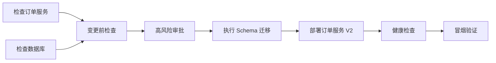
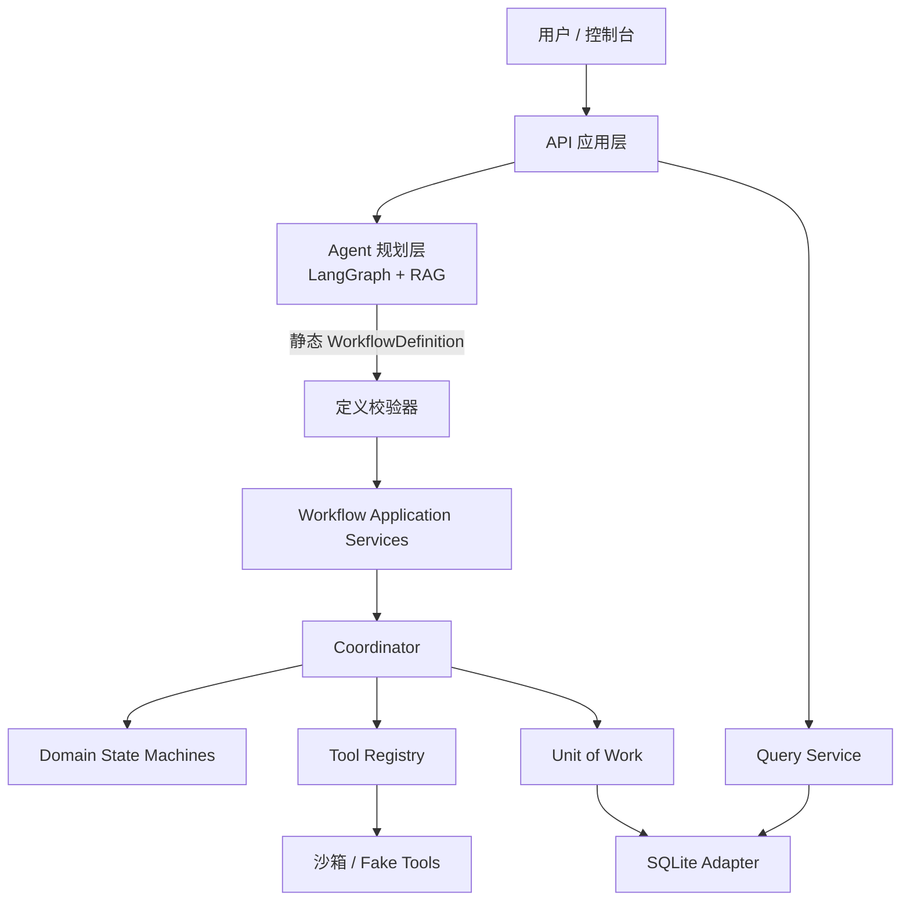
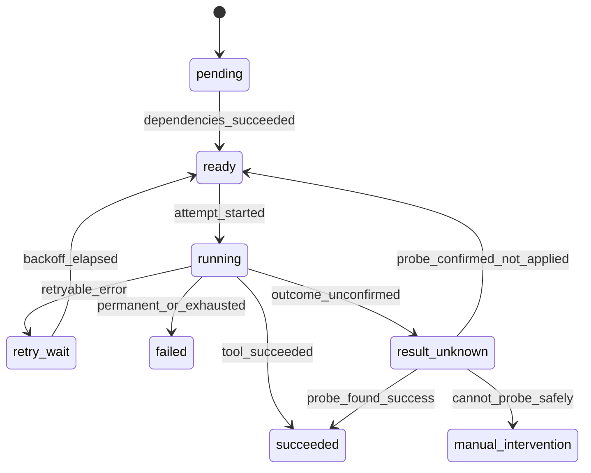

# ChangePilot 可靠工作流内核技术设计

## 1. 文档定位

本文细化 ChangePilot V1 的可靠工作流内核实现。能力需求与验收场景以 OpenSpec change `establish-reliable-workflow-core` 为唯一事实源；本文只描述实现结构、算法、事务边界、接口、测试和风险控制，不创建第二套需求规格。

V1 的目标是用一个可本地运行、可故障注入的后端内核证明以下工程能力：

- 将 Agent 生成的不确定计划转换为经过校验的静态任务图。
- 以确定性状态机执行任务图，并持久化运行检查点。
- 在高风险操作前等待人工审批。
- 在进程中断、工具超时或部分成功后安全恢复。
- 通过幂等探测、有限重试和显式补偿控制外部副作用。
- 为每个关键动作生成可查询、已脱敏的审计轨迹。

## 2. 企业变更场景与系统映射

核心演示场景是“订单服务版本升级并执行数据库 Schema 变更”。用户提交升级意图后，ChangePilot 检索研发规范和操作手册，分析服务与数据库依赖，生成任务图，完成变更前检查，等待高风险操作审批，在本地沙箱中执行变更并验证状态；失败时执行补偿或转人工处理，同时支持中断恢复和审计追踪。

该场景在完整产品架构中的映射如下：

| 场景动作 | 所属模块 | 本 change 的职责 |
| --- | --- | --- |
| 用户提交订单服务升级请求 | API / 控制台 | 后续 change 接入，通过 `WorkflowService` 创建运行 |
| 检索规范、分析依赖、生成计划 | Agent 规划层 / RAG | 后续使用 LangGraph；输出稳定 Schema，不直接执行工具 |
| 校验步骤、依赖、风险与工具参数 | 可靠工作流内核 | 本 change 实现 |
| 计算就绪步骤、审批、重试、恢复、补偿 | 可靠工作流内核 | 本 change 实现 |
| 检查服务、迁移 Schema、部署和回滚 | 沙箱工具适配器 | 本 change 定义契约并提供 Fake Tool，真实工具后续实现 |
| 展示进度和审计时间线 | API / 控制台 | 本 change 提供查询服务，页面后续实现 |

固定验收 DAG 如下：



规划层提交的每个步骤包含稳定步骤标识、依赖列表、工具名称和版本、结构化参数、风险级别、重试策略及可选补偿工具。工作流内核只执行通过校验并冻结的定义，不在运行期间重新解释自然语言，也不允许 LLM 动态修改已开始的计划。

## 3. 总体架构

采用“Agent 规划层与可靠执行层分离”的架构。LangGraph 可在后续 change 中负责任务理解、RAG 检索和计划生成，但不拥有可靠执行状态。执行内核自研，以显式事务、状态机和工具端口为中心。



代码按以下层次组织：

```text
src/changepilot/workflow/
|-- domain/
|   |-- definitions.py
|   |-- runs.py
|   |-- states.py
|   |-- policies.py
|   `-- errors.py
|-- application/
|   |-- services.py
|   |-- coordinator.py
|   |-- scheduler.py
|   `-- recovery.py
|-- ports/
|   |-- persistence.py
|   |-- tools.py
|   |-- clock.py
|   `-- identifiers.py
`-- adapters/
    |-- persistence/
    |   |-- memory.py
    |   `-- sqlite.py
    `-- tools/
        `-- fake.py
```

### 3.1 依赖规则

- `domain` 只依赖 Python 标准库，使用 `dataclass`、`Enum` 和纯函数表达不变量。
- `application` 依赖领域对象和端口，不依赖 SQLAlchemy、SQLite、Web 框架或具体工具。
- `ports` 定义持久化、工具、时钟和 ID 生成接口。
- `adapters` 实现端口，可依赖 SQLAlchemy、SQLite 和具体外部系统。
- Pydantic v2 只用于边界 DTO、工作流定义 Schema 和工具输入输出验证，不侵入领域状态机。

## 4. 核心领域模型

### 4.1 不可变定义

`WorkflowDefinition` 在创建运行前完成规范化和校验，随后以版本和 SHA-256 内容摘要冻结。摘要输入使用字段排序稳定的 canonical JSON，包含步骤、依赖、工具版本、参数、风险、重试和补偿配置。

关键对象包括：

- `WorkflowDefinition`：定义 ID、版本、摘要、步骤集合和依赖边。
- `StepDefinition`：步骤 ID、工具引用、参数、依赖、风险、重试策略和补偿引用。
- `ToolReference`：工具名称与精确版本，不使用隐式“最新版”。
- `RetryPolicy`：最大尝试次数和退避参数，默认 3 次，硬上限 10 次。
- `CompensationDefinition`：独立工具引用及从正向结果构造补偿参数的受限映射。

V1 只接受静态 DAG。单个运行最多 100 个步骤和 1000 条边；禁止条件路由、运行时添加步骤、循环和通用表达式求值。补偿关联不属于正向 DAG 的依赖边，但必须在定义校验时验证工具存在和参数契约。

### 4.2 可变运行状态

`WorkflowRun` 保存定义 ID、定义版本、定义摘要、当前状态、乐观锁 `revision`、创建时间、更新时间及原始失败。`StepRun` 保存当前状态、最近尝试号、稳定逻辑幂等键和可空的完成序号。

步骤尝试、审批请求和审计事件是独立的追加记录，不能被当前状态覆盖：

- `StepAttempt` 记录一次实际调用或探测，包括 attempt number、阶段、错误分类和脱敏结果。
- `ApprovalRequest` 记录与当前计划和参数绑定的审批快照及决定。
- `AuditEvent` 记录每个关键行为，并在单个 run 内使用单调递增 sequence 排序。

## 5. 状态机

### 5.1 运行状态

运行状态为：

- `pending`：已创建，尚未调度。
- `running`：正在调度或存在在途工具。
- `waiting_approval`：全局审批屏障已建立。
- `succeeded`：所有正向步骤成功。
- `failed`：失败且无需或无法开始补偿。
- `compensating`：正在执行显式补偿。
- `compensated`：所需补偿全部成功。
- `cancelled`：执行副作用前取消，或审批拒绝后按策略终止。
- `manual_intervention`：结果未知或补偿失败，禁止继续自动动作。

运行终态为 `succeeded`、`failed`、`compensated`、`cancelled` 和 `manual_intervention`。所有转换由显式转换表校验；非法或使用过期 revision 的转换被拒绝并记录相应事件。

### 5.2 步骤状态



补偿尝试复用同一状态语义，但以 attempt phase 区分 `forward`、`probe` 和 `compensation`，不把正向步骤的成功状态改写为失败。

## 6. 持久化模型与事务边界

V1 使用 SQLAlchemy 2.0 Core 和 Alembic。SQLite 启用 `foreign_keys=ON`、WAL 和 `busy_timeout`。数据库连接、事务和 SQL 仅存在于持久化适配器。

建议表结构如下：

| 表 | 关键内容 |
| --- | --- |
| `workflow_definitions` | version、canonical definition、digest、created_at |
| `workflow_runs` | definition reference、state、revision、original_error、timestamps |
| `step_runs` | run/step 唯一键、state、completion_sequence、logical_idempotency_key |
| `step_attempts` | attempt number、phase、tool version、error class、redacted result |
| `approval_requests` | request version、plan digest、step/tool/args digest、decision |
| `audit_events` | run sequence、event type、step/attempt references、redacted payload |

主要约束包括：

- 定义版本不可原地更新。
- `(run_id, step_id)`、`(run_id, step_id, attempt_no, phase)` 唯一。
- `(run_id, sequence)` 唯一，sequence 在写事务内分配。
- 同一运行的有效待审批请求具有唯一约束。
- 更新运行和步骤时使用 `revision` 或期望状态做 compare-and-swap。

### 6.1 单次状态转换事务

每次状态转换与对应审计事件在同一个短事务中完成：

1. 读取运行及期望 revision。
2. 校验领域转换与业务不变量。
3. 更新运行或步骤状态。
4. 追加审计事件并分配 sequence。
5. 提交事务；任一步骤失败则整体回滚。

事务期间不调用外部工具，也不等待审批。该边界确保数据库内部的“当前状态”和“发生过什么”不会分裂。

### 6.2 工具调用的双事务边界

外部副作用无法加入 SQLite 事务，因此每次工具调用跨越两个数据库事务：

1. 调用前事务：将步骤置为 `running`，创建 attempt，保存稳定幂等键，追加 `tool_attempt_started`。
2. 事务外：调用工具，并由工具自身的 I/O deadline 约束时间。
3. 调用后事务：写入脱敏结果或错误，转换步骤状态，追加结束事件。

进程可能在第 2 步产生副作用后、执行第 3 步前退出。恢复逻辑必须先使用相同幂等键调用 `probe`，不能直接再次执行工具。

## 7. 稳定端口与应用接口

### 7.1 工具契约

```python
class Tool(Protocol):
    descriptor: ToolDescriptor

    def execute(
        self,
        context: ToolExecutionContext,
        arguments: BaseModel,
    ) -> ToolResult: ...

    def probe(
        self,
        query: RecoveryQuery,
    ) -> RecoveryResult: ...
```

`ToolDescriptor` 必须声明：

- `name` 与 `version`。
- Pydantic 输入和输出 Schema。
- 默认风险等级及允许的风险覆盖范围。
- 幂等能力：`supported`、`probe_only` 或 `none`。
- 默认超时、硬超时上限和敏感字段路径。

工具必须显式注册。未注册工具、版本不匹配或参数校验失败会在创建运行前被拒绝。补偿使用另一个已注册工具，不在工具类中提供隐藏的 `rollback()`。

Python 线程不能安全强制终止任意函数，因此协调器的超时只能停止等待并把结果标记为未知。工具实现必须给 HTTP、数据库或子进程设置底层 deadline；无法探测结果的非幂等工具转入人工介入。

### 7.2 应用服务

稳定应用接口为：

```text
WorkflowService.create_run(definition) -> RunId
WorkflowService.cancel_run(run_id, expected_revision) -> WorkflowRunView
ApprovalService.decide(request_id, decision, expected_version) -> ApprovalView
Coordinator.run_once() -> CoordinationReport
QueryService.get_run(run_id) -> WorkflowRunView
QueryService.list_events(run_id, after_sequence) -> list[AuditEventView]
```

后续 REST API、CLI、控制台和 Agent 只能调用这些服务，不直接操作仓储或状态字段。

### 7.3 Unit of Work

`UnitOfWork` 提供 definitions、runs、steps、attempts、approvals 和 events 仓储，并明确 `commit()` / `rollback()`。应用服务必须在一个 Unit of Work 内完成状态转换及事件追加。内存和 SQLite 适配器运行同一套契约测试。

## 8. 调度与并发

V1 使用单协调器和有界 `ThreadPoolExecutor`。默认并发度为 4，可配置但硬上限为 16。只有协调器线程写数据库；工作线程只执行工具并返回不可变 `ExecutionOutcome`，避免 SQLite 多写者竞争和状态转换分散。

`Coordinator.run_once()` 执行：

1. 加载一个非终态运行及 revision。
2. 收集已完成 Future 的 outcome，并在短事务内提交结果。
3. 若运行处于补偿阶段，优先调度下一补偿步骤。
4. 若存在有效待审批请求，保持屏障并停止分派。
5. 根据已提交状态计算所有就绪步骤。
6. 按拓扑层级和 step ID 稳定排序。
7. 在执行池容量内分派步骤，并先提交调用前事务。
8. 所有步骤成功则结束运行；无就绪、无在途且非终态时报告一致性错误。

调度语义是至少一次，不宣称外部副作用恰好一次。稳定排序用于可重复测试和审计理解，不承诺互不依赖工具的实际完成顺序。

## 9. 审批屏障

任一需要审批的高风险步骤变为 ready 时，协调器建立运行级全局屏障：

1. 停止分派新的正向步骤。
2. 等待已分派工具返回并持久化结果。
3. 创建审批请求，并将运行置为 `waiting_approval`。
4. 收到有效决定后恢复，或按拒绝策略终止和补偿。

审批绑定值由工作流定义摘要、步骤 ID、工具名称与版本、脱敏参数摘要共同计算。批准后任何绑定内容变化都会使原审批失效。提交决定时使用 request version 乐观锁，重复或过期决定被拒绝。

审批拒绝且尚无已完成副作用时，运行进入 `cancelled`；若已有需恢复的副作用，则进入 `compensating`。审批行为只记录操作者标识和理由，不在 V1 实现完整 RBAC。

## 10. 幂等、恢复与错误处理

### 10.1 稳定幂等键

逻辑幂等键从 `run_id + step_id + tool_name + tool_version` 生成，并在该逻辑步骤的所有正向重试和恢复探测中保持不变。attempt number 每次递增，用于区分调用历史，不进入逻辑幂等键。

补偿使用独立命名空间的幂等键，例如在相同基础输入中加入 `compensation` 和正向完成序号，避免与正向副作用冲突。

### 10.2 启动恢复

新进程启动后扫描非终态运行：

- `pending`、`running` 且无未决 running attempt：重新计算 ready 集合。
- 存在没有终结记录的 running attempt：根据工具幂等能力先 probe。
- `waiting_approval`：恢复同一个审批请求，不创建重复请求。
- `compensating`：根据持久化补偿尝试继续恢复。
- 无法安全确定外部结果：进入 `manual_intervention`。

恢复决策本身追加审计事件。系统不能用内存 Future 作为事实源，进程重启后只相信数据库检查点和工具 probe 结果。

### 10.3 错误分类与重试

错误分为：

- `retryable`：短暂网络故障、明确未应用的限流等，可按策略重试。
- `permanent`：参数、权限或业务前置条件失败，立即终止正向步骤。
- `result_unknown`：超时、连接中断或进程退出导致副作用结果不确定，先 probe。
- `internal_consistency`：非法状态或调度停滞，停止执行并暴露诊断信息。

退避时间由注入的 `Clock` 计算，测试使用 `FakeClock`，不进行真实等待。达到最大尝试次数后按失败策略进入 `failed` 或 `compensating`。非幂等工具一旦结果未知，不允许自动重试。

## 11. 补偿

补偿是业务恢复动作，不是跨系统事务回滚。仅对已经提交成功且声明补偿工具的步骤创建补偿计划。

执行顺序为：

1. 按成功步骤的逆拓扑顺序处理依赖关系。
2. 对拓扑上互不依赖的步骤，按持久化 `completion_sequence` 逆序。
3. 每个补偿动作独立记录 attempt、幂等键、结果和审计事件。
4. 补偿成功后继续下一项；失败或结果未知且无法探测时立即停止。

所有补偿完成后运行进入 `compensated`。补偿失败时进入 `manual_intervention`，同时保留原始正向错误和补偿错误，不用后者覆盖前者。

订单服务验收场景中，可将“Schema 迁移”的补偿定义为回退迁移，将“部署 V2”的补偿定义为恢复 V1。健康检查失败后先恢复服务版本，再按依赖关系回退 Schema。Fake Tool 只模拟这些效果，不连接生产系统。

## 12. 安全与审计

工具参数中的密钥只能通过 `SecretRef` 引用，例如环境变量名称或后续密钥管理系统中的引用 ID。原始密钥不得写入工作流定义、attempt、事件、日志或异常文本。

统一脱敏器处理：

- 工具 descriptor 声明的敏感字段路径。
- 常见凭据字段名和 `SecretRef`。
- 工具结果、异常消息和审计 payload。
- 审批参数摘要和查询视图。

`audit_events` 是应用层追加式事件表。V1 禁止应用接口修改和删除事件，但不宣称 SQLite 文件可抵抗拥有文件权限的攻击者。事件在 V1 永久保留；签名、外部归档和保留策略属于后续增强。

## 13. 配置与运行环境

技术基线为 Python 3.12、Pydantic v2、SQLAlchemy 2.0 Core、Alembic、pytest 和 Hypothesis。核心测试必须能在 Windows 原生和 WSL2 运行，不依赖 Docker、DeepSeek API 或网络。

V1 关键默认值：

| 配置 | 默认值 | 硬限制 |
| --- | --- | --- |
| 工具并发度 | 4 | 16 |
| 单运行步骤数 | 100 | 100 |
| 单运行依赖边 | 1000 | 1000 |
| 最大尝试次数 | 3 | 10 |
| SQLite busy timeout | 5 秒 | 可配置 |
| 事件保留 | 永久 | V1 不清理 |

## 14. 测试设计

### 14.1 领域单元测试

- 覆盖运行和步骤的完整合法转换表及所有非法转换。
- 覆盖 DAG 的重复 ID、悬空依赖、环、规模限制和稳定就绪排序。
- 覆盖审批摘要绑定、失效、拒绝和乐观锁冲突。
- 覆盖错误分类、重试上限、逻辑幂等键稳定性和补偿顺序。
- 使用 Hypothesis 生成 DAG，验证步骤不会早于依赖成功、成功步骤不会重复产生已确认副作用、补偿顺序不违反逆依赖等不变量。

### 14.2 仓储契约测试

内存与 SQLite 适配器执行相同测试套件：

- Unit of Work 提交和回滚。
- 状态转换与审计事件原子提交。
- revision 乐观锁冲突。
- run 内事件 sequence 唯一且单调。
- 有效审批唯一性和 attempt 唯一性。
- 进程重新连接后完整恢复定义和运行状态。

通过故障注入让事件写入失败，断言状态更新同步回滚，以直接覆盖新增 OpenSpec 验收场景。

### 14.3 协调器集成测试

使用可编排 `FakeTool`、`FakeClock` 和确定性 ID：

- 并行就绪步骤受执行池容量限制。
- 高风险步骤建立全局审批屏障。
- retryable 错误按退避和上限重试。
- permanent 错误不重试。
- result_unknown 经过 probe 后成功、重试或转人工。
- 正向失败触发正确补偿，补偿失败保留双重错误。

### 14.4 进程级恢复测试

SQLite 保存工作流状态，独立文件账本模拟外部副作用。测试通过子进程在固定故障点强制退出：

- 工具调用前事务提交后、工具调用前。
- 工具已产生副作用、结果事务提交前。
- 已创建审批请求并进入等待状态后。
- 补偿已产生副作用、补偿结果提交前。

重启后断言系统使用相同幂等键探测，不重复写入外部账本，并能恢复同一审批或补偿进度。

### 14.5 核心验收

固定订单服务升级 DAG 至少覆盖三条端到端路径：

1. 检查、审批、迁移、部署和验证全部成功。
2. 健康检查失败，按逆依赖顺序完成服务与 Schema 补偿。
3. 工具产生副作用后进程中断，重启通过 probe 识别既有结果并继续。

安全测试额外覆盖未注册工具、非法参数、目录或密钥泄露、异常文本脱敏和过期审批拒绝。

## 15. 实施顺序

1. 建立 Python 项目、领域对象、定义校验和状态转换表。
2. 定义端口并实现内存适配器与领域测试。
3. 建立 SQLite Schema、Alembic 迁移和仓储契约测试。
4. 实现工具注册表、双事务调用、错误分类和幂等恢复。
5. 实现协调器、并发限制、审批屏障和补偿。
6. 完成进程故障测试、固定演示 DAG 和本地运行文档。

每一步保持可测试并与 OpenSpec tasks 对齐。Agent 规划层、真实数据库迁移工具和 Web 控制台在执行内核稳定后分别通过后续 change 接入。

## 16. 风险与非目标

- SQLite 适配器只支持单协调器。V1 不实现多协调器租约、分布式 Worker、消息队列或高吞吐调度。
- V1 不实现真实生产数据库连接、Docker 沙箱、多租户、完整 RBAC 或机密管理系统。
- Python 线程超时不能强杀底层操作，必须由工具 I/O deadline 和结果探测共同控制风险。
- 至少一次调度与幂等协议降低重复副作用风险，但不能把不支持幂等的外部系统变成恰好一次。
- 补偿可能失败，也可能无法恢复全部业务语义，因此人工介入是正式终态而不是异常遗漏。
- LangGraph 只属于后续规划层，不应替换本设计中的事务、审批、幂等和补偿内核。

后续迁移 PostgreSQL 时新增持久化适配器，并在需要多协调器时引入数据库租约或队列。只要领域端口和应用接口保持稳定，上层 Agent、API 和控制台无需理解底层存储变化。
