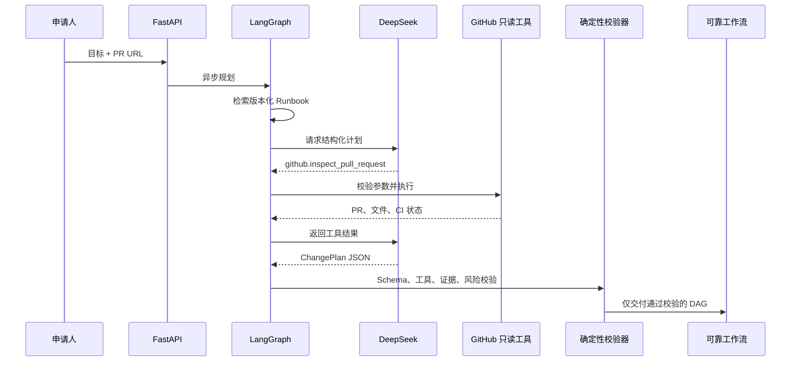

# 异步工具调用与 GitHub 上下文

## 目标

V2 第一轮把 ChangePilot 从“仅根据表单和 Runbook 规划”扩展为
“可以主动读取真实研发上下文的 Release Agent”。申请人可附带 GitHub Pull
Request URL；在线 DeepSeek 模式使用原生 Function Calling 读取 PR 元数据、
变更文件和 CI Check，再生成结构化变更计划。

## 为什么是原生 Tool Calling

执行计划中的 `schema.migrate` 等名称是未来动作；Function Calling 是模型在
规划过程中为补充事实而发起的即时观察。两者由不同注册表管理：

- **发现工具**：异步、只读、可由模型在限定轮次内调用。
- **执行工具**：版本化、带风险与幂等契约，只能由可靠工作流在审批后调用。

模型不能通过 Function Calling 直接部署服务、执行 SQL 或 Shell。

## 异步边界

FastAPI 的请求入口使用异步处理，并把仍包含同步沙箱操作的完整请求放入工作
线程。LangGraph 使用 `ainvoke`，DeepSeek 使用 `AsyncOpenAI`，GitHub 使用
`httpx.AsyncClient`。这样模型和外部 API 等待不会阻塞 API 事件循环，同时保留
原有同步服务接口供 CLI 和离线测试使用。

## GitHub 安全边界

`github.inspect_pull_request` 只接受
`https://github.com/{owner}/{repository}/pull/{number}`：

- 固定 GitHub 主机和 HTTPS，避免任意 URL 与 SSRF。
- 工具参数必须与申请人提交的 PR 完全一致。
- 禁止跟随重定向。
- 只调用 PR、文件列表和 Check Runs 的读取接口。
- Token 从环境变量读取，不进入计划、轨迹或报告。
- 工具名和 Pydantic 参数必须命中只读注册表。
- 工具调用轮次有上限，未知工具立即拒绝。

工具结果仍被视为不可信输入。最终计划必须经过原有的 Pydantic Schema、
工具白名单、证据引用、风险升级、审批和补偿校验。

## 可观察性

规划轨迹新增工具名称、轮次、状态、耗时、参数和截断后的输出摘要。控制台把
Function Calling 与 RAG 证据分开展示，因此可以回答“模型为什么需要这个
上下文”“它实际读了什么”“最终计划是否通过确定性边界”。

## 当前边界

默认 `deterministic_mock` 模式继续完全离线，不调用 GitHub。设置
`CHANGEPILOT_PLANNER_MODE=deepseek` 后启用真实异步模型和 Function Calling。
当前 GitHub 集成只读，执行阶段仍使用本地订单服务沙箱；真实发布、数据库和
组织权限适配器不在本轮范围内。
