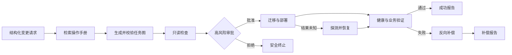

# ChangePilot 用户指南

首次打开控制台时，系统会自动展示简短的产品内指南。之后可通过顶部的
**使用指南**随时重新打开，或选择**开始引导演示**直接进入场景创建。

## 一句话理解

ChangePilot 是一个**面向高风险研发变更的受约束 Agent 原型**。它接收“升级
服务并修改数据库”这样的目标，把目标转化为有证据、有依赖关系的执行计划，
在危险操作前等待人工审批，然后使用可靠工作流执行、验证、补偿或恢复。

当前版本把 Agent 的动作空间限制在一个服务和两类变更目标：

> 将 `order-service` 从 V1 升级到 V2，同时把订单数据库 Schema 从 V1
> 迁移到 V2。
>
> 只读评估当前 V1 服务与数据库是否具备变更条件。

限定领域是为了让不同目标产生的计划差异、工具调用、审批、幂等、补偿和恢复
都能被验证，而不是用任意 Shell 或 SQL 掩盖安全边界。

## 它解决什么问题

一次真实研发变更通常不只是“执行一条命令”，还包含：

1. 理解变更目标和成功条件。
2. 检索操作手册与组织规范。
3. 分析服务、数据库和步骤依赖。
4. 识别数据库迁移等高风险动作。
5. 在正确的时间请求人工审批。
6. 执行部署和迁移，并持续验证状态。
7. 失败时判断应该重试、补偿、恢复还是转人工。
8. 保存可查询、可导出的审计证据。

ChangePilot 把这些分散的决策组织成一个受约束的 Agent 控制平面。模型负责
提出计划，确定性代码负责安全边界和真实副作用。

## 它不是什么

- **不是通用聊天机器人**：它围绕明确的变更目标和工具契约工作。
- **不是 Claude Code 或 Codex 的替代品**：编码 Agent 修改代码；
  ChangePilot 编排已经定义好的研发变更流程。
- **不是生产发布平台**：当前适配器只操作本地 SQLite 与隔离订单服务。
- **不是任意命令执行器**：V1 不接受任意 SQL、Shell、文件路径或网络地址。
- **不是“让大模型决定一切”**：审批、幂等、预算、补偿和状态转换由代码
  强制执行。

## 谁会使用

| 角色 | 在 ChangePilot 中做什么 |
| --- | --- |
| 变更申请人 | 提交目标、成功条件和约束 |
| 操作者/审批人 | 审阅计划、证据、风险和补偿策略，批准或拒绝风险步骤 |
| 平台工程师 | 定义工具契约、策略、操作手册、适配器和可靠性边界 |
| 审计或值班人员 | 查看终态报告、失败原因、补偿结果和有序事件 |

## 完整闭环



这个闭环包含 Agent 的四个核心动作：

- **感知**：读取请求、操作手册、服务状态和数据库指纹。
- **推理**：形成有依赖关系的计划，并给出风险和证据。
- **行动**：调用版本化工具，但危险副作用必须经过审批。
- **反馈**：根据工具结果继续、补偿、恢复或停止，并把过程写入审计日志。

## 控制台怎么看

进入一个运行后，优先阅读中央区域顶部的运行引导：

1. **流程阶段**：请求、计划审阅、前置检查、审批、执行、验证、结果。
2. **当前结论**：系统为什么停在这里，或者最后发生了什么。
3. **下一步**：此刻需要操作者做出的唯一主要动作。
4. **变更上下文**：服务、版本、变更目标、成功条件和约束。
5. **安全控制**：本次运行实际启用的审批、幂等、补偿和审计边界。
6. **Agent 规划轨迹**：查看每个规划节点、精确 RAG 证据、校验状态、知识快照
   和模型预算用量。

其余三个工作区分别承担：

- **左侧运行列表**：在不同变更运行之间切换并按状态筛选。
- **中央执行计划**：查看步骤依赖、风险、知识证据、验证目标和补偿工具。
- **右侧审批与审计**：批准或拒绝风险步骤，恢复未知结果，查看权威事件，
  并在运行结束后下载报告。

工具名、步骤 ID 和事件类型保留英文，因为它们需要与 API、源码和审计记录
精确对应。界面说明可在顶栏切换中英文。

## 五分钟成功演示

### 1. 启动

首次使用先安装 Python 与前端依赖，之后运行：

```powershell
.\scripts\start-operations-demo.ps1
```

打开：

- 控制台：`http://127.0.0.1:5173`
- API 文档：`http://127.0.0.1:8000/docs`

### 2. 提交变更

点击“新建变更”，选择“成功升级”，然后创建计划。V1 会使用固定的订单服务
目标、V1 到 V2 版本和审批约束。

### 3. 理解为什么暂停

运行会完成服务检查、数据库检查和兼容性前置检查，然后停在
`migrate-schema`：

- 顶部阶段显示“审批”为当前阶段。
- 当前结论显示“等待数据库迁移审批”。
- 迁移步骤列出操作手册证据和 `schema.rollback` 补偿工具。
- 此时 `schema.migrate` 尚未产生副作用。

也可以选择“就绪度检查”。它证明计划不是固定的 V1 到 V2 模板：同一条 Agent
链路会理解只读目标，只生成服务检查、数据库检查和兼容性前置检查三步，不执行
迁移、部署，也不产生审批或补偿。

### 4. 批准并观察执行

点击“批准”。工作流继续迁移 Schema、部署 V2、执行健康检查和订单冒烟
测试。终态应为“成功”，全部阶段完成。

### 5. 查看证据

右侧审计时间线按单调序号展示审批、工具调用和状态变化。运行结束后可下载
Markdown 报告。在“评测”页可以看到开发集与保留集的安全指标、Token 统计
和零在线费用。

## 两个可靠性演示

### 健康检查失败

新建变更时选择“健康检查失败”。批准后，Schema 迁移和 V2 部署会成功，
健康检查按故障配置失败。工作流按完成顺序反向执行：

```text
service.restore -> schema.rollback
```

最终状态为 `compensated`。这个场景证明失败后不是简单地“再次执行”，而是
按照显式补偿策略恢复 V1。

### 重启恢复

选择“重启恢复”。Schema 迁移在数据库中已经提交，但工作流在收到结果前
中断，因此步骤状态为 `result_unknown`。

点击“恢复运行”后，运行时先探测迁移台账：

- 找到已提交结果时，把原步骤确认为成功。
- 不会再次执行同一个迁移副作用。
- 随后继续部署和验证。

这个场景证明工作流不会只相信内存状态，而会同时核对持久化检查点和外部
系统事实。

## 可靠性由什么保证

| 风险 | 当前保证 |
| --- | --- |
| 未审批执行数据库迁移 | 后端审批状态与绑定摘要校验；前端不能绕过 |
| 重复执行副作用 | 逻辑幂等键、工具效果台账和恢复探测 |
| 进程中断后丢失进度 | SQLite 持久化工作流检查点与审计事件 |
| 失败后恢复顺序错误 | 按已完成步骤的逆序执行显式补偿 |
| 客户端显示过期状态 | 服务端状态权威、版本冲突返回、SSE 游标与快照校准 |
| 模型生成危险计划 | 严格 Schema、允许工具集合、风险策略和确定性校验 |
| 在线评测意外超支 | 默认关闭，并限制样例、调用、Token 和预估费用 |
| 凭据进入报告 | 服务端递归脱敏，模型凭据不写入运行与评测结果 |

## 当前边界

当前仓库证明的是**控制平面语义**，不是生产环境已经完成：

- 服务和数据库都是本地隔离适配器。
- 只有一个固定升级场景和一组版本化工具。
- 不包含企业身份、RBAC、工单系统和真实审批组织关系。
- 不包含 Kubernetes、云部署、真实 PostgreSQL 迁移和备份系统。
- 不承诺分布式事务或多节点高可用。

生产化时可以替换工具适配器，但应该保留计划 Schema、审批绑定、幂等键、
恢复探测、补偿元数据、审计事件和评测门槛。

## 为什么它仍然是 Agent 项目

RAG、LangGraph 或 LLM API 只是实现手段。ChangePilot 被称为 Agent，是因为
它在明确边界内持续执行“观察、规划、行动、反馈”，并根据运行结果选择下一
动作。与固定 Dify 工作流相比，计划可由上下文动态形成；与通用编码 Agent
相比，它的动作空间更窄，但审批、事务语义、恢复和审计约束更强。

这也是项目和数据库内核经历的连接点：复杂系统不能只关注“成功路径”，还要
定义依赖关系、状态失效、重建条件、事务边界、失败恢复和版本兼容。

## 常见问题

### 为什么不让 Agent 自动批准？

审批是权限边界，不是模型推理能力问题。高风险副作用需要独立主体确认，
否则模型既提出动作又授权动作，无法形成有效控制。

### 为什么当前只能升级订单服务？

固定场景让每个工具、故障和期望结果都可测试。扩展新场景时，应先定义版本化
工具、证据、风险、补偿和评测样例，而不是先开放任意命令。

### 为什么同时需要补偿和恢复？

补偿处理“已知失败且需要撤销”；恢复处理“结果未知，必须先探测事实”。
如果把两者混为重试，可能重复产生副作用。

### 为什么需要评测页？

Agent 的输出包含动态计划，不能只依赖普通单元测试。版本化评测把计划质量、
危险动作阻断、审批、幂等、恢复、补偿和成本转化为可比较指标。
